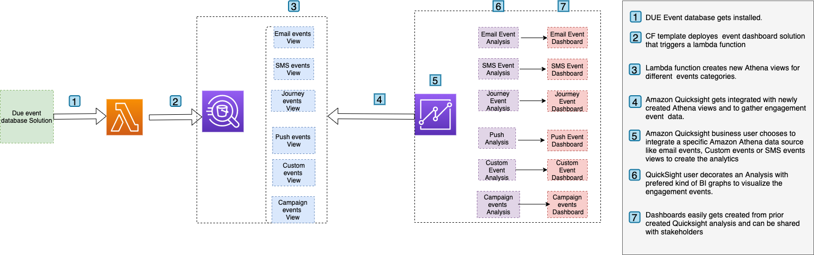

# Due-events-Dashboard

Create Quicksight dashboard from Pinpoint/SES events

Solution
This solution enhances the DUE events database solution by allowing all events retrieved using Amazon Athena to be shown in Amazon Quicksight as engagement events. In chronological order, this solution can be accomplished in three steps.
1. Create a database solution for events.
2. Install the CloudFormation template for Athena View.
3. Set up Amazon Quicksight to dashboard engagement event analytics and event dashboard by following the steps in the blog.

Use case(s)
User segmentation based on: 
• A deep dive into event insights 
• User segmentation based on: (for example, SMS, Email, Campaign, and Journey events)
• An individual user's engagement event dashboard.
• Data/business process mining 
• User engagement benchmarking and funneling

Step 1 – Create AWS account & Pinpoint Project
Create an AWS account
Implement [Event database solution](https://aws.amazon.com/solutions/implementations/digital-user-engagement-events-database/) 
Copy and save the 1/DUE database name 2/S3 Bucket name from DUE event database solution, this will be needed as input parameters in 

Step 2 – Create S3 bucket for Lambda code and upload the Zip file 
1.	This step explains on how to deploy the code ZIP file 
2.	Create an S3 bucket in the region that you have your Pinpoint projects and provide it a unique name
    2.1.	Upload the zip file into the root folder: lambda_view_creator.zip. Install the cloud formation stack template within the same region as that of your DUE database is. Provide following details as input parameter to cloud formation stack and proceed with the installation. Zip Code package

Step 3 – Deploy Cloudformation template

1.	This step creates several new amazon Athena views that’s to be act as a data source for Amazon Quicksight. Dashboard 
2.	Navigate to Cloud formation page in AWS console, click up right on “Create stack” and select the option “With new resources (standard)”
3.	Leave the “Prerequisite – Prepare template” to “Template is ready” and for the “Specify template” option, select “Upload a template file”. On the same page, click on “Choose file”, browse to find the file “DUE_analytics_dashboard.template” file and select it. Once the file is uploaded, click “Next” and deploy the stack
4.	See below information for each of the 6 fields under the section “Specify stack details”:
    a.	EventAthenaDatabaseName - As mentioned in Step1
    b.	LambdaCodes3bucket – S3 bucket name where you have installed the code zip file.
    c.	S3DataLogBucket- As mentioned in Step1
5.	This solution will create additional 5 Athena views which are 
    a.	All_email_events
    b.	All_SMS_events
    c.	All_custom_events (Custom events can be Mobile app/WebApp/Push Events)
    d.	All_campaign_events
    e.	All_journey_events

#### AWS CloudFormation Link
[CF Template](Event-dashboard.template)

Step 4 – Create Amazon Quicksight engagement Dashboards

- This is a step by step blog on how to integrate the newly created Athena views with Amazon Quicksight
Please Refer - https://github.com/Satya-Git3105/Due-events-dashboard/blob/main/Pinpoint-Event-dashboard.docx 